# Demo - Cisco IOS XE - Postman Collections

This demo contains a POSTMAN environment and collection that can be used to interact with the IOS XE on C9300. Postman collection for Cisco IOS XE RESTCONF + YANG Model Driven Programmability interface (API)

You can edit the variables in the environment to point to your own IOS XE device. Feel free to modify them as you see fit and to add more calls to the collection.

Background

RESTCONF stands for the HTTP-based Representational State Transfer Configuration Protocol (RESTCONF). RESTCONF provides a programmatic interface based on standard mechanisms for accessing configuration data, state data, data-model-specific Remote Procedure Call (RPC) operations and events, defined in the YANG model.


This RESTful API allows a computer to interact with networking devices to get information from them and to push information. We also can manage large amount of devices with just a single computer using network automation.

RESTful API uses HTTPS and commands like PUT and GET to send information to and from the Cisco devices.


In this demo you will learn:
* How to enable RESTCONF on a Cisco C9300 switch
* How to create and manipulate the Postman collections

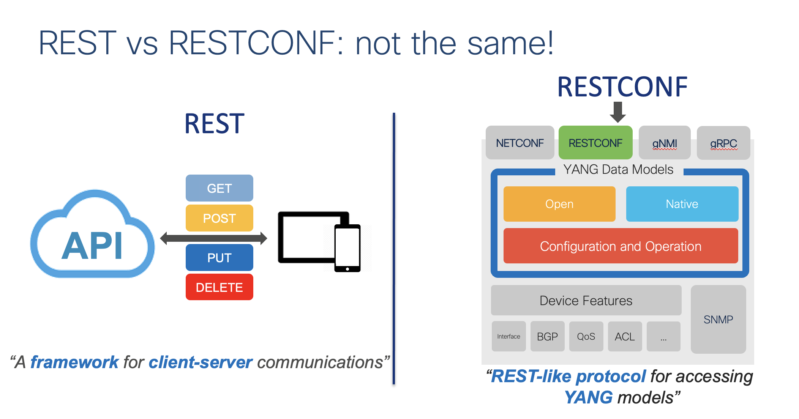


### Step 1 : Enable RESTCONF on the device

In your terminal window, telnet to 10.1.1.5.


Enter the following configurations to enable RESTCONF on the switch

```
conf t
ip http secure-server
ip http authentication local
restconf
aaa new-model
aaa authentication login default local
aaa authorization exec default local
aaa session-id common
username admin privilege 15 secret 9 ....
```

#### Prerequisite steps: create Postman Collection

These steps are already done for you!

Navigate to Postman application to create your first Postman Collection

* Click on **"New"**

* In the pop-up window click on **"Collection"**

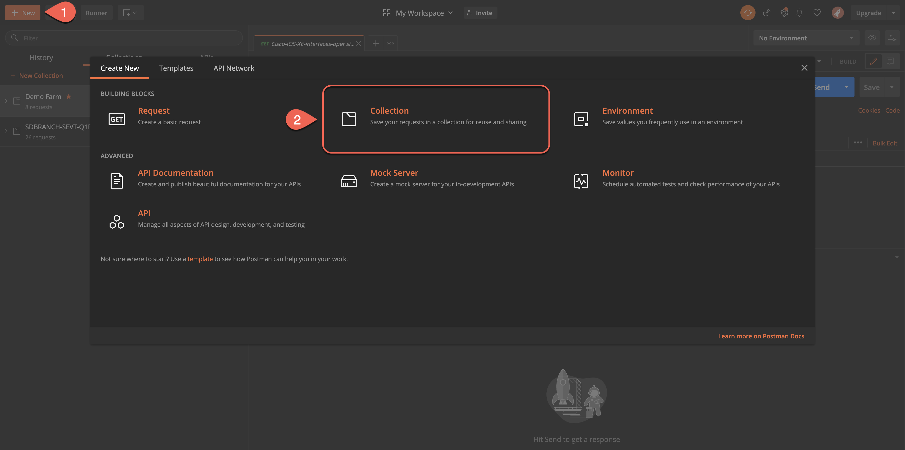

* In the "Collection Name" Bar enter the following name:

**Programmability and Automation**
* Navigate to the **"Authorization"** tab and select **"Type"** from the drop-down - **"Basic Auth"**

* Enter Username and Password

```
Username: admin
Password: Cisco123
```
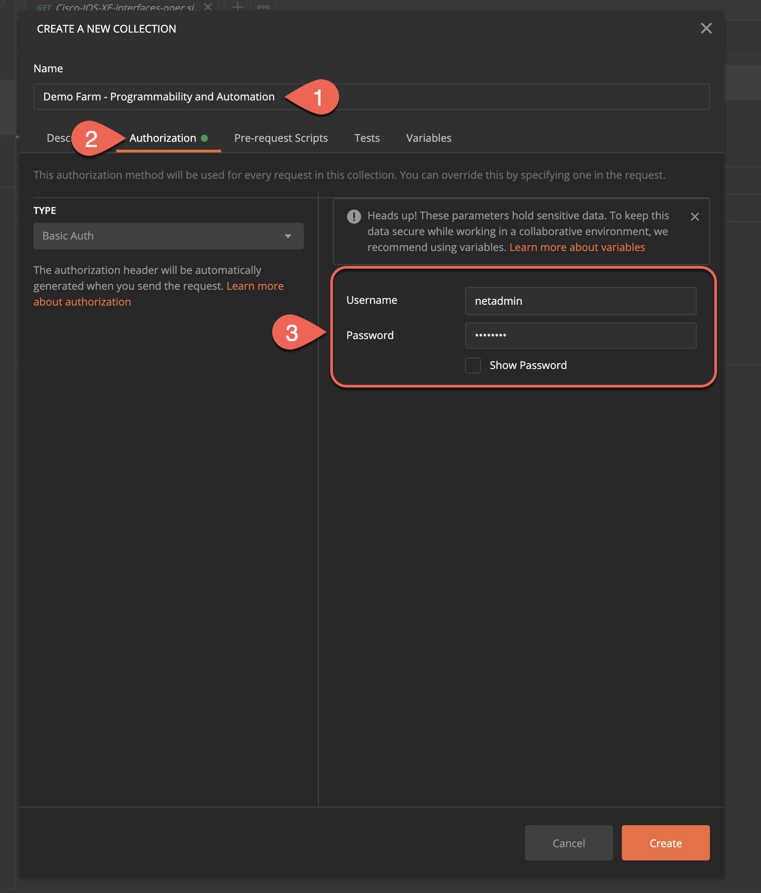


1. Navigate to **"Variables"** tab and create the following new variables that we are going to use in this demo
```
      **Variable**      **Initial Value**       **Current Value**
        host              10.1.1.5                10.1.1.5
        username          admin                   admin
        password          Cisco123                Cisco123
```

2. Select **"Create"**

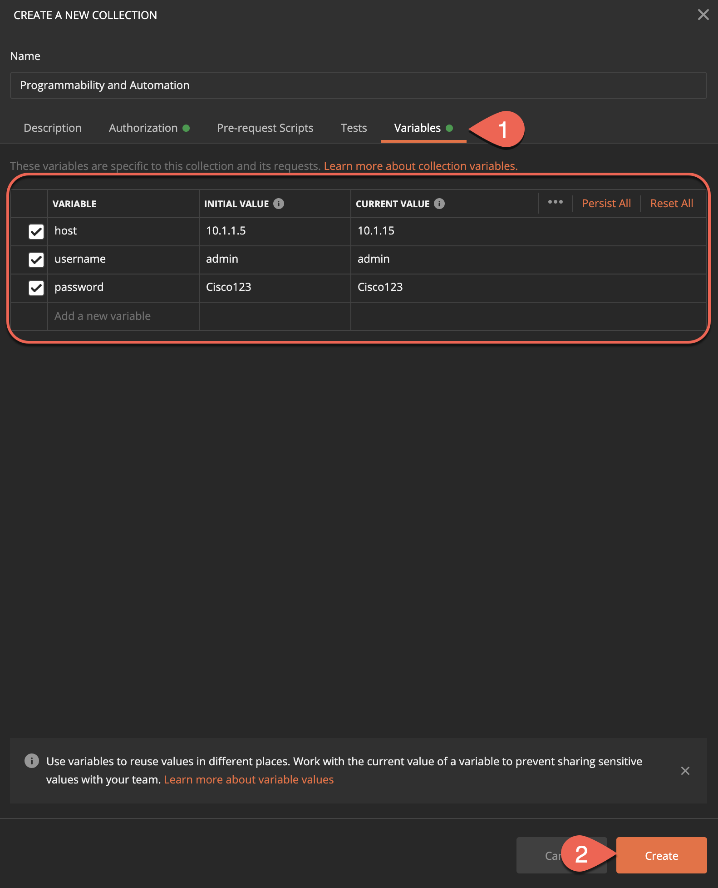

#### Prerequisite step: Create Folder within the Collection

These steps are already done for you!

* Next to the collection that you have created, click on three dots.

* Select **"Add Folder"**

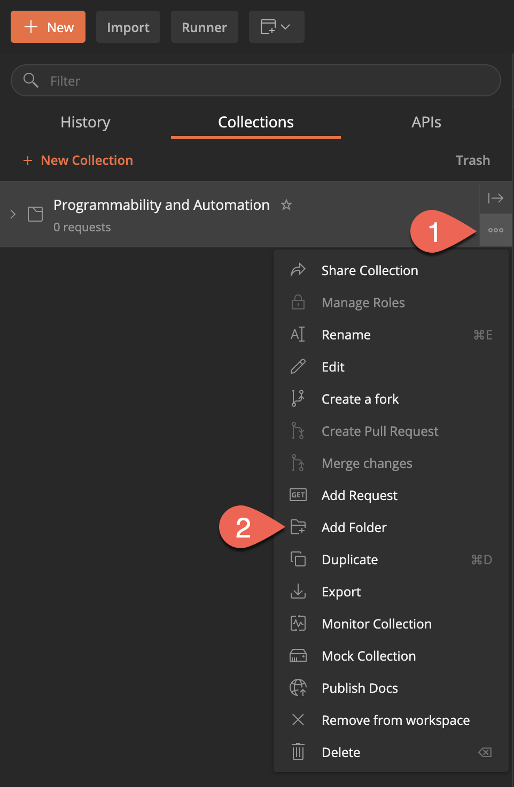
<p></p>

* Create a folder name - **"RESTCONF"**

* Navigate to **"Authorization tab"**
* For the type select **"Inherit auth from parent"**
* Click on **"Create"**


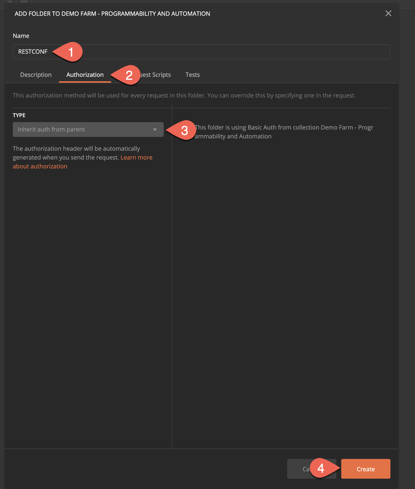

### Step 4: Create GET/PATCH/POST/DELETE API calls

#### First API Call

* Enter request URL where {{host}} is your variable **10.1.1.5**

  * https://{{host}}/restconf/data/ietf-interfaces:interfaces


* Navigate to **"Authorization"** and select **"Inherit auth from parent"**

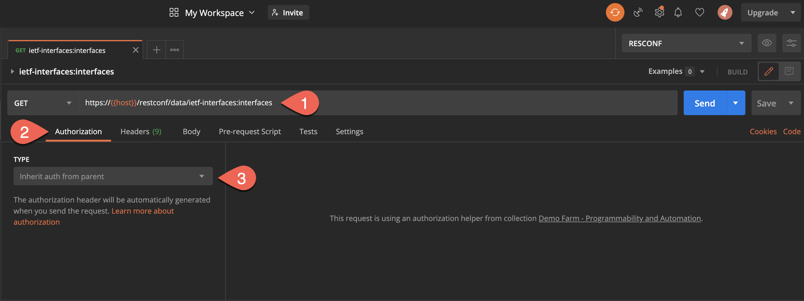

* Navigate to **"Headers"** and enter the following information

* In the Key field enter **"Accept"** and **"Content-Type"**
* In the Value field enter **"application/yang-data+json"** for both field

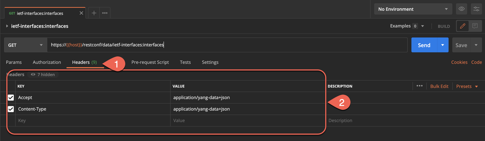

#### Save the first API call

* Click on **"Save"** button

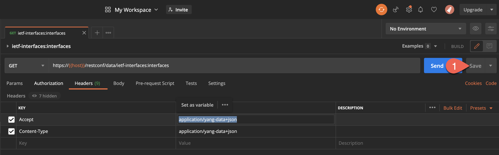

* In the **"Request name"** field enter - **ietf-interfaces:interfaces**

* Select a collection or folder to save to: **"RESTCONF"**
* Click on **"Save to RESTCONF"**

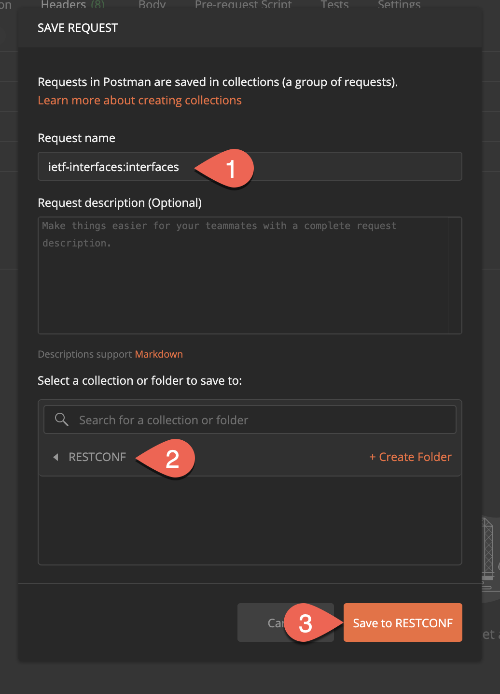
<p></p>

* Click **"Send"**

You should get the following response:

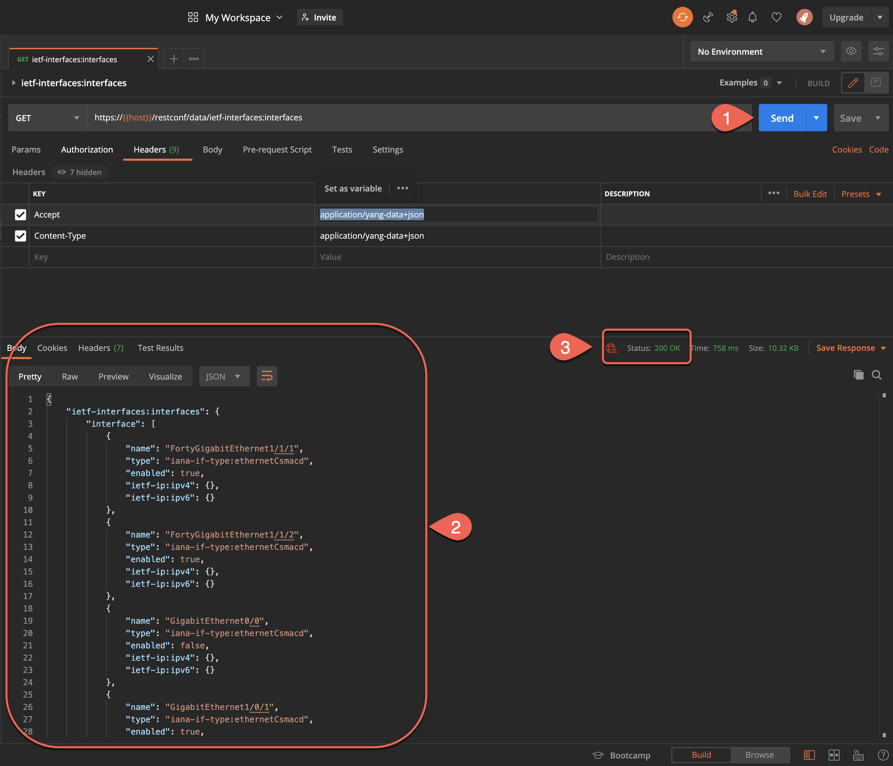

*Notice the status of the response, it defines the status of the request. In our case, we got status 200 OK, which means that we got a successful request.*

## Congratulations, you successfully created and saved your first API call!!!


### Perform the same steps for the following GET requests

<p></p>

**Read entire configuration (same as show running-config)**

https://{{host}}/restconf/data/Cisco-IOS-XE-native:native


**Read all vlans on device**

https://{{host}}/restconf/data/Cisco-IOS-XE-vlan-oper:vlans/vlan


**Send a request to get a single interface**

https://{{host}}/restconf/data/Cisco-IOS-XE-interfaces-oper:interfaces/interface=GigabitEthernet1%2F0%2F14/

https://{{host}}/restconf/data/Cisco-IOS-XE-native:native/interface/GigabitEthernet=1%2F0%2F14/

**Read mac addresses for a specific interface (Read MAC Address Table)**

https://{{host}}/restconf/data/Cisco-IOS-XE-matm-oper:matm-oper-data

**Read all arp entries**

https://{{host}}/restconf/data/Cisco-IOS-XE-arp-oper:arp-data

### Create a PATCH request
* In the URI bar enter the following. We will change the interface description.

   * https://{{host}}/restconf/data/Cisco-IOS-XE-native:native/interface/GigabitEthernet


* From the drop-down, select **"PATCH"**

* Enter the same **"Authentication"** and **"Headers"** information as we did in GET request
* Navigate to **"Body"** and select **"raw"**, make sure that **"JSON"** format is selected
* In the editing window, enter the following:

```
{  

"Cisco-IOS-XE-native:GigabitEthernet": [    

{      "name": "1/0/1",      

       "description": "Working with Postman API calls"    

} ] }

```

* Save the **"PATCH"** request to the **RESTCONF** folder

* Click on **"Send"**

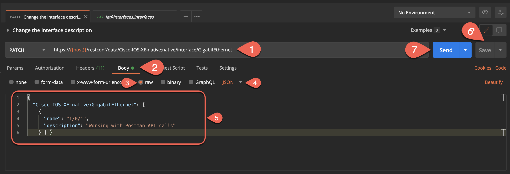

### Verify the following description change

* Create the new "GET request" to verify the description change

* Enter the following **"URL"**
  * https://{{host}}/restconf/data/Cisco-IOS-XE-native:native/interface/GigabitEthernet=1%2F0%2F1


* Enter the same **"Authorization"** and **"Headers"** information as we did in GET request

* Save the request to the **"RESTCONF"** folder
* Click on **"Send"** and examine the result

*Notice that the description of the **GigabitEthernet 1/0/1** interface has the description* **"Working with Postman API call"**

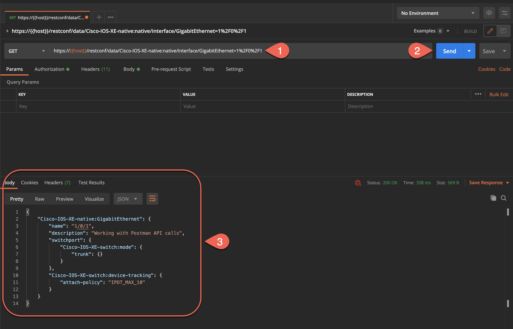

### Create a POST request

Let's add the new loopback interface

* Create a new POST request by entering there following URL

  * https://{{host}}/restconf/data/ietf-interfaces:interfaces


* Select **"POST"** from the drop-down

* Enter the same **"Authorization"** and **"Headers"** information as we did in GET request
* In the **"Body"** tab, enter the following configuration. Make sure so select **"JSON"** format

```
{    

    "ietf-interfaces:interface": {        

         "name": "Loopback100",        

         "description": "Configured by RESTCONF",       

         "type": "iana-if-type:softwareLoopback",       

         "enabled": true,        

         "ietf-ip:ipv4": {           

              "address": [               

                     {                    

                           "ip": "172.16.100.1",                    

                           "netmask": "255.255.255.0"                

                      }            

               ]        

          }    

      }

}

```
* Save the request to the **"RESTCONF"** folder

* Click on **"Send"** and examine the result

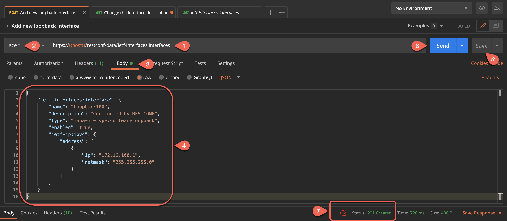

*Notice the Status of the request is - **201 Created**. It means that the request was successful and the data was created.*

Make sure to verify if this request took effect by sending the GET request to this URL.

https://{{host}}/restconf/data/ietf-interfaces:interfaces/interface=Loopback100

### Create a DELETE request

Since we have just created the new Loopback interface and verified the results. Let's try to delete the same interface by using the **DELETE** request.

* Enter the following URL

  *https://{{host}}/restconf/data/ietf-interfaces:interfaces/interface=Loopback100


* Select **"DELETE"** from the drop-down

* Enter the same **"Authorization"** and **"Headers"** information as we did in GET request
* Save the request to the **"RESTCONF"** folder
* Click on **"Send"** and examine the result

*Notice that the Status of the request is **204 No Content**, it means that the response is empty and we have successfully deleted the Loopback interface.*

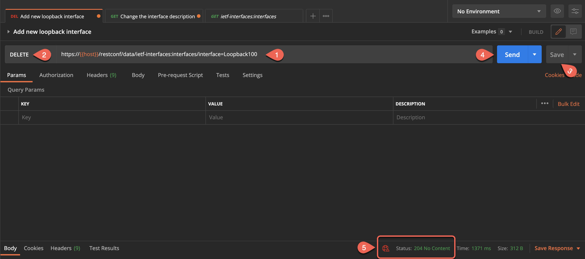

Let's verify that the delete request took effect by simply changing the request from DELETE to GET

*Notice that the status of this request is **404 Not Found** which means that the data was not found and we have successfully deleted the Loopback100.*

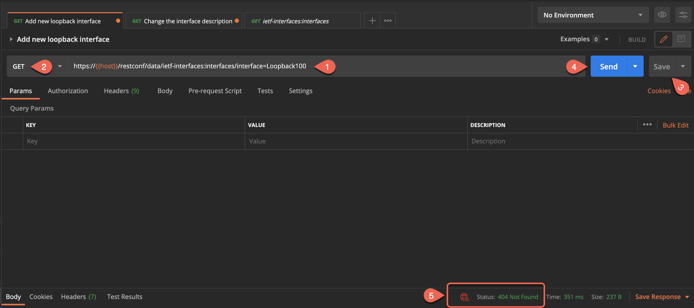
