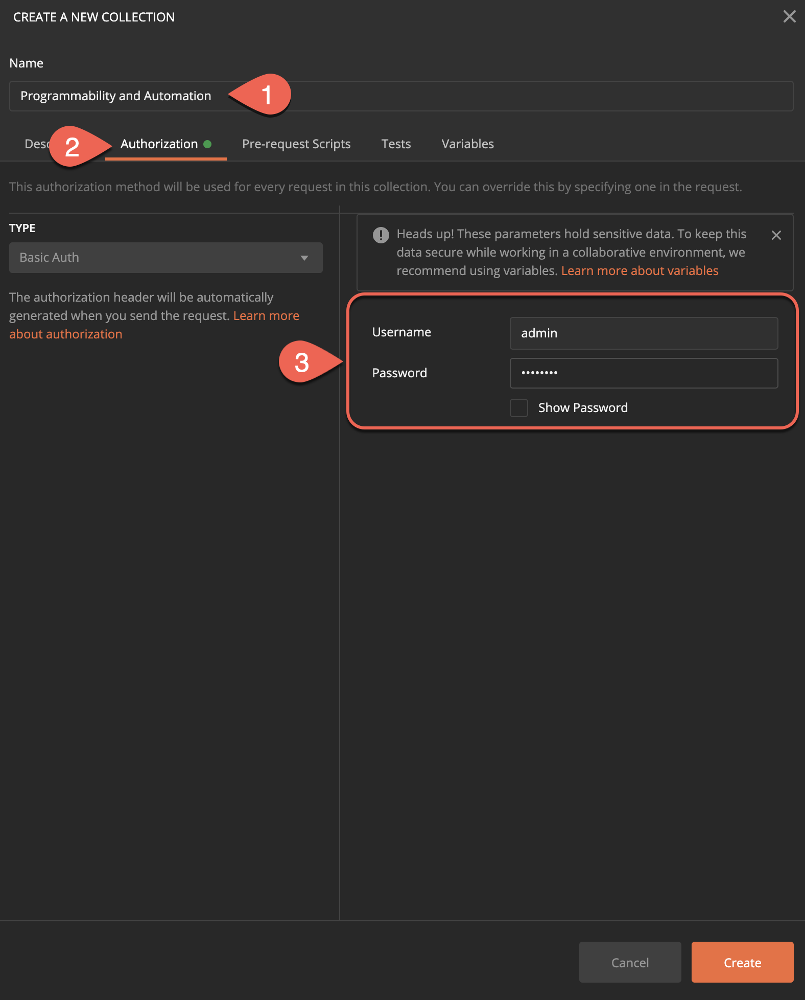

# Demo - Cisco IOS XE - Postman Collections

This demo contains a POSTMAN environment and collection that can be used to interact with the IOS XE on CSR Latest Code Always On Sandbox. The IOS XE on CSR Latest Code Always On Sandbox offers developers shared, VPNless access to an IOS XE device running the latest IOS XE code release available on cisco.com. Here you can test out the newest programmability features and data models available

The environment is pre-configured to access the IOS XE on CSR Latest Code Always On Sandbox. Postman collection for Cisco IOS XE RESTCONF + YANG Model Driven Programmability interface (API)

You can edit the variables in the environment to point to your own IOS XE device. Feel free to modify them as you see fit and to add more calls to the collection.

Background

RESTCONF stands for the HTTP-based Representational State Transfer Configuration Protocol (RESTCONF). RESTCONF provides a programmatic interface based on standard mechanisms for accessing configuration data, state data, data-model-specific Remote Procedure Call (RPC) operations and events, defined in the YANG model.


This RESTful API allows a computer to interact with networking devices to get information from them and to push information. We also can manage large amount of devices with just a single computer using network automation.

RESTful API uses HTTPS and commands like PUT and GET to send information to and from the Cisco devices.


In this demo you will learn:
* How to enable RESTCONF on a Cisco C9300 switch
* How to create and manipulate the Postman collections


### Step 1 : Enable RESTCONF on the device

In your terminal window, telnet to 10.1.1.5.


Enter the following configurations to enable RESTCONF on the switch

```
conf t
ip http secure-server
ip http authentication local
restconf
aaa new-model
aaa authentication login default local
aaa authorization exec default local
aaa session-id common
username admin privilege 15 secret 9 ....
```

#### Prerequisite steps: create Postman Collection

These steps are already done for you!

Navigate to Postman application to create your first Postman Collection

* Click on **"New"**
* In the pop-up window click on **"Collection"**


* In the "Collection Name" Bar enter the following name:
**Programmability and Automation**
* Navigate to the **"Authorization"** tab and select **"Type"** from the drop-down - **"Basic Auth"**
* Enter Username and Password

```
Username: admin
Password: Cisco123
```



1. Navigate to **"Variables"** tab and create the following new variables that we are going to use in this demo
      **Variable**      **Initial Value**       **Current Value**
```

        host              10.1.1.5                10.1.1.5
        username          admin                   admin
        password          Cisco123                Cisco123
```

2. Select **"Create"**


#### Prerequisite step: Create Folder within the Collection

These steps are already done for you!

* Next to the collection that you have created, click on three dots.
* Select **"Add Folder"**


<p></p>

* Create a folder name - **"RESTCONF"**
* Navigate to **"Authorization tab"**
* For the type select **"Inherit auth from parent"**
* Click on **"Create"**


### Step 4: Create GET/PATCH/POST/DELETE API calls

#### First API Call

* Enter request URL where {{host}} is your variable 10.1.1.5
https://{{host}}/restconf/data/ietf-interfaces:interfaces
Navigate to "Authorization" and select "Inherit auth from parent"
